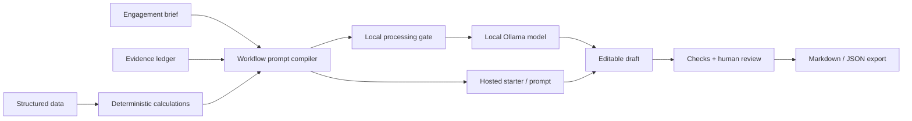

# Architecture and evaluation

## Decisions

- A single workflow orchestrator serves this scope. No autonomous research or automatic client communication.
- Calculations run without a model. Interpretations are separate from measured data.
- Users supply evidence excerpts. URLs are not fetched, and source validity is not inferred.
- Static hosting and local AI are separate. GitHub Pages cannot run Node/Ollama. Hosted AI drafting needs a future authenticated backend and approved model connection.
- No application database exists. Exports are portable but may contain sensitive material.
- Imported content and model output are rendered as text, never executable HTML.

## Evaluation before production

Use a synthetic benchmark with contradictory sources, missing evidence, injected instructions, ambiguous meeting decisions, and inconsistent commercial terms. Compare the same model with a basic prompt and a workbench prompt.

Measure citation entailment, unsupported claims, arithmetic accuracy, invented decisions/commitments, editing time, privacy-route enforcement, and completion. Have human reviewers score a defined rubric. Report model/settings, denominators, failures, and uncertainty. Do not publish expected improvements as observed outcomes.

Automated tests use mocked inference and cannot establish real model accuracy, injection resistance, expert suitability, or production security. Real inference requires an installed running Ollama model.

## Production roadmap

Authenticated hosted inference, tenant isolation, controlled storage, retention/deletion, provider approvals, audited tools, retrieval with provenance, document/slide file generation, and human-reviewed benchmarks. Specialty packs need domain-specific validation.
